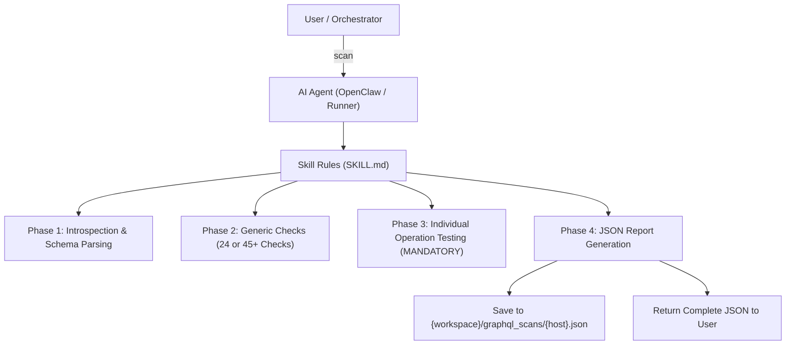

# Agent Integration Guide — GraphQL Vulnerability Scanner

This guide explains how to install, configure, and orchestrate **GraphQL Scanner** and **Extended GraphQL Scanner** with AI agents (such as OpenClaw, Antigravity, Claude Code, and other agentic runners).

---

## 1. Overview & Architecture

The scanner is packaged as an **Agent Skill** consisting of instructions (`SKILL.md`), reference queries (`templates/introspection.graphql`), and payload templates (`templates/payloads.md`).



### Scanner Variants

| Skill | Checks | Description | Best For |
| :--- | :---: | :--- | :--- |
| **`graphql-scanner`** | 24 | Standard vulnerability scanner suite covering auth bypass, injection (SQLi, NoSQLi), IDOR, depth abuse, CORS, APQ, batching, and error leakage. | Fast audits, standard CI/CD checks, rate-limited environments. |
| **`extended-graphql-scanner`** | 45+ | Extended deep security suite adding 21 checks for SSTI, command injection, mass assignment, JWT forgery, nested BOLA/BFLA, N+1 DoS, and WebSockets. | Comprehensive bug bounty, penetration testing, deep audits. |

---

## 2. Installation & Setup

### Agent Environment Prerequisites
The agent requires access to a shell tool (e.g., `exec` or `run_command` with `curl`) or an HTTP client tool to send requests to the target GraphQL endpoint.

### Option A: Install via Natural Language (in Agent Chat)
Simply instruct your agent in chat:

```text
Please install the extended-graphql-scanner skill from this repository.
```

### Option B: Command-Line Installation

#### 1. Standard Scanner (`graphql-scanner`)
```bash
# Register skill with OpenClaw workspace
mkdir -p ~/.openclaw/workspace/skills/graphql-scanner/
cp -r graphql-scanner/* ~/.openclaw/workspace/skills/graphql-scanner/
```

#### 2. Extended Scanner (`extended-graphql-scanner`)
```bash
# Register skill with OpenClaw workspace
mkdir -p ~/.openclaw/workspace/skills/extended-graphql-scanner/
cp -r extended-graphql-scanner/* ~/.openclaw/workspace/skills/extended-graphql-scanner/
```

---

## 3. Agent Invocation Recipes

Agents understand the following prompt patterns:

### Basic Unauthenticated Scan
```text
scan https://api.example.com/graphql
```

### Specific Skill Selection
```text
Run a full security scan on https://api.example.com/graphql using extended-graphql-scanner
```

### Authenticated Scan (Bearer Token / Custom Headers)
```text
scan https://api.example.com/graphql -H "Authorization: Bearer <TOKEN>" -H "X-Api-Key: <KEY>"
```

### Scan with Session Cookies
```text
scan https://api.example.com/graphql -H "Cookie: sessionid=xyz123; auth=abc"
```

---

## 4. Agent Execution Lifecycle

When an agent executes a scan, it must strictly complete all four phases in order:

```
┌─────────────────────────────────────────────────────────────────────────────┐
│ 1. Phase 1: Setup & Introspection                                           │
│    • Initialize request counters and timestamp.                             │
│    • Attach mandatory research headers (x-info, x-email, User-Agent).       │
│    • Run introspection query; extract queries, mutations, types, and args.  │
│    • If introspection fails: attempt introspection bypass & Clairvoyance.   │
├─────────────────────────────────────────────────────────────────────────────┤
│ 2. Phase 2: Generic Checks (24 or 45+ checks)                              │
│    • Run checks (CORS, CSRF, APQ, Batching, Depth, JWT, WAF, etc.).         │
│    • Enforce DoS safety limits (max 20 aliases, max 10 batch, depth <= 10). │
├─────────────────────────────────────────────────────────────────────────────┤
│ 3. Phase 3: Individual Operation Testing (MANDATORY)                       │
│    • Send individual HTTP requests to each discovered query and mutation.   │
│    • Test each for auth bypass, SQLi, NoSQLi, and IDOR.                     │
│    • SAFETY: SKIP all mutations matching destructive keywords (delete,      │
│      update, remove, destroy, drop, ban, suspend, revoke, cancel).          │
├─────────────────────────────────────────────────────────────────────────────┤
│ 4. Phase 4: Report Generation & Verification                                │
│    • Verify all checklist items (testing_coverage, requests_sent > 0).      │
│    • Save to: {workspace}/graphql_scans/{full_hostname}.json                │
│    • Output the complete structured JSON report.                            │
└─────────────────────────────────────────────────────────────────────────────┘
```

---

## 5. Mandatory Agent Rules & Safety Guardrails

When configuring or fine-tuning agent prompts, ensure the agent adheres to these critical rules:

1. **Mandatory Research Headers:** Every HTTP request MUST include:
   ```http
   x-info: This-is-a-scanner-for-research
   x-email: random-researcher-at-gmail-dot-com
   User-Agent: Mozilla/5.0 (Windows NT 10.0; Win64; x64) AppleWebKit/537.36 (KHTML, like Gecko) Chrome/120.0.0.0 Safari/537.36
   ```
2. **Never Skip Phase 3:** The scan is considered invalid if individual queries and mutations are not tested with actual HTTP requests.
3. **Destructive Mutation Protection:** Mutations containing `delete`, `update`, `remove`, `destroy`, `drop`, `ban`, `suspend`, `cancel`, `revoke`, or `deactivate` MUST be recorded in `mutations_skipped` and NOT executed.
4. **No False Positives:** The following are standard, expected security behaviors and must **NEVER** be reported as vulnerabilities:
   * Introspection disabled
   * Authentication required
   * Rate limiting active
   * Batching disabled
5. **Real Request Counting:** `requests_sent` must reflect the exact number of HTTP requests dispatched.
6. **Automatic File Persistence:** Reports must be written to disk under `{workspace}/graphql_scans/{full_hostname}.json` (e.g. `api.example.com.json`).

---

## 6. Output JSON Schema & Downstream Consumption

The scanner outputs a deterministic JSON report designed for direct ingestion into CI/CD security gates or reporting pipelines:

```json
{
  "scan": {
    "target": "https://api.example.com/graphql",
    "timestamp": "2026-08-27T14:00:00Z",
    "duration_seconds": 185,
    "requests_sent": 84,
    "schema_discovered": true,
    "graphql_engine": "Apollo Server",
    "cdn_waf": "Cloudflare",
    "queries_discovered": ["getUser", "listProducts", "getOrders"],
    "mutations_discovered": ["createAccount", "updateProfile", "deleteUser"],
    "total_queries": 3,
    "total_mutations": 3,
    "total_subscriptions": 0,
    "total_types": 18
  },
  "testing_coverage": {
    "total_queries_discovered": 3,
    "queries_tested": 3,
    "queries_tested_names": ["getUser", "listProducts", "getOrders"],
    "queries_skipped": [],
    "total_mutations_discovered": 3,
    "mutations_tested": 1,
    "mutations_tested_names": ["createAccount"],
    "mutations_skipped": ["updateProfile", "deleteUser"],
    "selection_criteria": "All queries tested; destructive mutations skipped for safety."
  },
  "key_findings": [
    "Authentication missing on 'getUser' query allowing unauthenticated user enumeration.",
    "Introspection enabled on production endpoint."
  ],
  "vulnerabilities": [
    {
      "id": "VULN-001",
      "title": "Unauthenticated Data Disclosure",
      "category": "Query Testing",
      "severity": "HIGH",
      "cvss_estimate": 7.5,
      "affected_operation": "getUser",
      "summary": "The getUser query returns full user details without requiring an authentication token.",
      "evidence": {
        "request": "POST /graphql -d '{\"query\":\"query { getUser(id: \\\"1\\\") { id email name } }\"}'",
        "response_snippet": "{\"data\":{\"getUser\":{\"id\":\"1\",\"email\":\"user@example.com\",\"name\":\"Alice\"}}}",
        "status_code": 200
      },
      "remediation": "Enforce authorization middleware on the getUser resolver."
    }
  ],
  "summary": {
    "critical": 0,
    "high": 1,
    "medium": 1,
    "low": 0,
    "info": 0,
    "total": 2
  }
}
```

---

## 7. Troubleshooting & Handling Edge Cases

* **Rate Limiting (429 HTTP Responses):** The agent should not abort. It must apply exponential backoff (sleep 2s → 5s → 10s) and continue remaining checks.
* **Introspection Blocked:** The agent will automatically test for introspection whitespace/fragment bypasses and execute suggestion fuzzing (`usr` → "Did you mean 'user'?") to reconstruct schema operations.
* **Non-Standard Endpoints:** If the GraphQL endpoint is hosted on `/api/graphql`, `/v1/graphql`, or custom routes, provide the full URL in the scan prompt.
